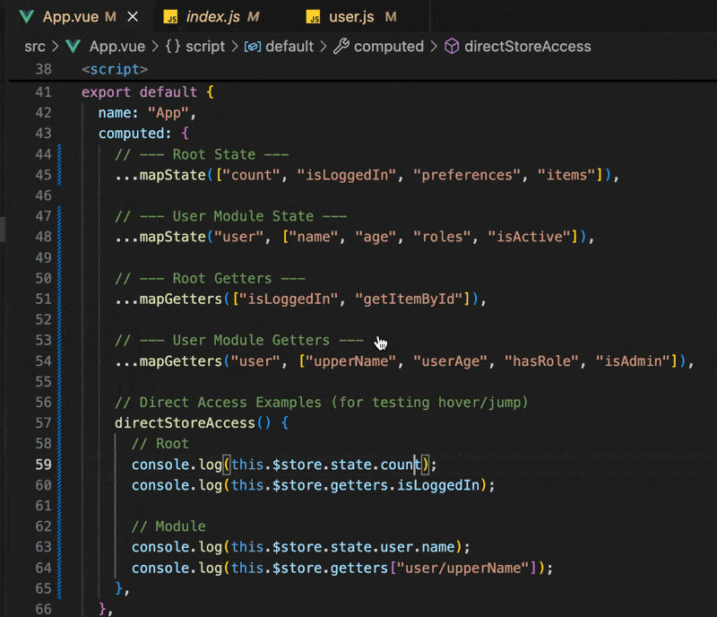
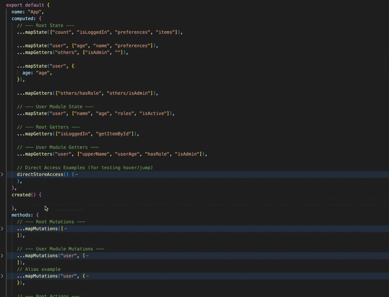
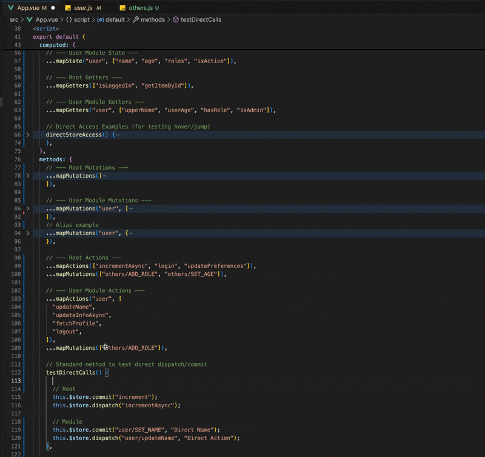
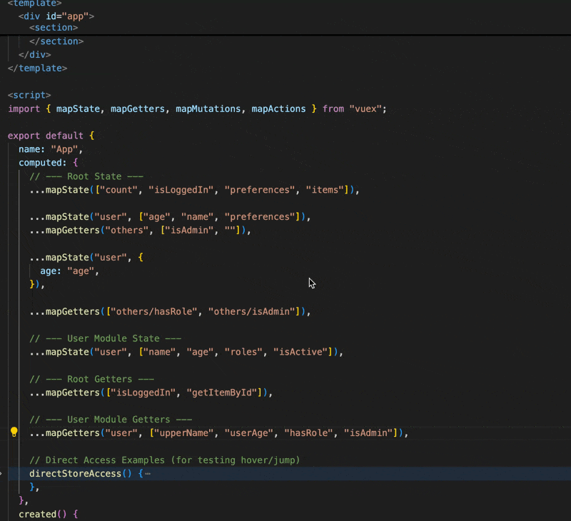
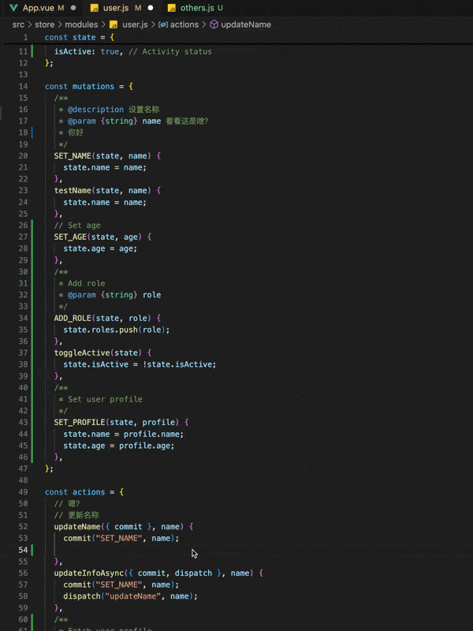

# Vuex Helper

[中文文档](./docs/README.zh-CN.md)

If you want Vuex firepower in VS Code, this extension is built to bring the full toolkit to one place: discover, complete, navigate, inspect, and validate your store workflow with confidence.

VS Code extension for Vuex 2 that provides **Go to Definition**, **Code Completion**, **Hover Information**, **Diagnostics**, and manual reindex support for State, Getters, Mutations, and Actions.

⭐ If you find this extension helpful, please give it a star on [GitHub](https://github.com/dmxiaoshubao/vuex-helper)! Your support is greatly appreciated.

## Features

### 1. Go to Definition

Jump directly to the definition of Vuex store properties from your components.

#### Demo: Jump to Definition

#### 

- **Support**: `this.$store.state/getters/commit/dispatch`, imported store instance access (e.g. `import store from '@/store'`)
- **Map Helpers**: `mapState`, `mapGetters`, `mapMutations`, `mapActions`
- **Namespace**: Supports namespaced modules.
- **Optional Chaining**: Supports `?.` in store access chains.

### 2. Intelligent Code Completion (IntelliSense)

Intelligent suggestions for Vuex keys and mapped methods.

#### Demo: Context-Aware Completion

#### 

#### 

- **Context Aware**: Suggests actions for `dispatch`, mutations for `commit`, etc.
- **Namespace Filtering**: When using `mapState('user', [...])`, it correctly filters and shows only items from the `user` module.
- **Mapped Methods**: Type `this.` to see mapped methods (e.g., `this.increment` mapped from `...mapMutations(['increment'])`).
- **Bracket Notation**: Support `this['namespace/method']` syntax for accessing mapped properties.
- **Map Helpers**: Supports array and object syntax (e.g., `...mapActions({ alias: 'name' })`).
- **Imported Store Completion**: Supports `store.state/getters/commit/dispatch` after direct store import.

### 3. Hover Information & Type Inference

View JSDoc documentation, details, and inferred types without leaving your code.

#### Demo: Hover Documentation

#### 

- **JSDoc Support**: Displays comments written in `/** ... */` format from your store definitions.
- **Type Inference**: Automatically infers and displays the type of State properties in hover tooltips (e.g., `(State) appName: string`).
- **Mapped Methods**: View documentation for mapped methods.
- **Details**: Shows the type (State/Mutation/etc.) and the file path of the definition.
- **Imported Store Hover**: Supports hover info for direct store import usage.

### 4. Store Internal Usage

Also supports code completion, jump to definition, and hover information within the Vuex Store.

#### Demo: Store Internal Code Completion, Jump to Definition, Hover Information



- **Module Scope**: When writing actions in a module (e.g., `user.js`), suggestions for `commit` and `dispatch` are automatically filtered to the current module's context.

### 5. Diagnostics

Highlights invalid Vuex store references as warnings directly in your editor.

- **Map Helpers**: Validates string arguments in `mapState`, `mapGetters`, `mapMutations`, `mapActions`.
- **Commit / Dispatch**: Checks first argument of `commit()` and `dispatch()` calls.
- **Store Access**: Validates first-segment `$store.state/getters` dot access and bracket notation.
- **Store Internal**: Validates store-file `state.xxx` access plus `rootState` / `rootGetters` references.
- **Comment Lines**: Skips common commented-out references on full comment lines.

### 6. Reindex Command

Run **"Vuex Helper: Reindex Store"** from the Command Palette (`Ctrl+Shift+P` / `Cmd+Shift+P`) to manually trigger a full store re-index.

## Configuration

You can configure the extension via the VS Code Settings UI or `.vscode/settings.json`:

- `vuexHelper.storeEntry` (default: empty, auto-detect): Path to your Vuex store entry file. Supports aliases like `@/store/index.js`, workspace-relative paths, and absolute paths. When left empty, the extension tries to discover the store by parsing `src/main.{js,ts}` or `src/index.{js,ts}` for `new Vue({ store })`.

## Supported Syntax

- **Helper Functions**:
  ```javascript
  ...mapState(['count'])
  ...mapState('user', ['name']) // Namespaced
  ...mapState({ alias: 'count' }) // Object aliasing
  ...mapState({ count: state => state.count }) // Arrow function
  ...mapState({ count(state) { return state.count } }) // Regular function
  ...mapActions({ add: 'increment' }) // Object aliasing
  ...mapActions(['add/increment'])
  ```
- **Store Methods**:
  ```javascript
  this.$store.commit("SET_NAME", value);
  this.$store.dispatch("user/updateName", value);
  import store from "@/store";
  store.commit("SET_NAME", value);
  store?.getters?.["others/hasNotifications"];
  commit("increment", null, { root: true }); // Root namespace switch
  ```
- **Component Methods**:
  ```javascript
  this.increment(); // Mapped via mapMutations
  this.appName; // Mapped via mapState
  ```

## Feature Coverage

| Feature                                     | Status | Notes                                              |
| ------------------------------------------- | ------ | -------------------------------------------------- |
| `mapState` — array syntax                   | ✅     | `...mapState(['count'])`                           |
| `mapState` — object string alias            | ✅     | `...mapState({ alias: 'count' })`                  |
| `mapState` — arrow function                 | ✅     | `...mapState({ c: state => state.count })`         |
| `mapState` — regular function               | ✅     | `...mapState({ c(state) { return state.count } })` |
| `mapState` — namespaced                     | ✅     | `...mapState('user', [...])`                       |
| `mapGetters` — array / object               | ✅     |                                                    |
| `mapMutations` — array / object             | ✅     |                                                    |
| `mapActions` — array / object               | ✅     |                                                    |
| `this.$store.state/getters/commit/dispatch` | ✅     | Dot and bracket notation                           |
| Imported store instance access              | ✅     | `import store from '@/store'`                      |
| Store access optional chaining              | ✅     | `this.$store?.getters?.['a/b']`                    |
| `createNamespacedHelpers`                   | ✅     |                                                    |
| Object-style commit                         | ✅     | `commit({ type: 'inc' })`                          |
| `state` as function                         | ✅     | `state: () => ({})`                                |
| Nested state                                | ✅     | Recursive parsing                                  |
| Computed property keys                      | ✅     | `[SOME_MUTATION](state) {}`                        |
| Dynamic module import/require               | ✅     | ES Module & CommonJS                               |
| Namespaced modules                          | ✅     | Including nested                                   |
| `this` alias completion                     | ✅     | `const _t = this; _t.`                             |
| `{ root: true }` namespace switch           | ✅     | commit/dispatch with root option                   |
| State chain intermediate jump               | ✅     | Click `user` in `state.user.name`                  |
| Vuex dependency detection                  | ✅     | Silent deactivation when workspace `package.json` has no `vuex` dependency and `vuexHelper.storeEntry` is unset |
| `rootState` / `rootGetters`                 | ✅     | Full support for completion, definition, and hover |
| Diagnostics for invalid store references    | ✅     | Warning on non-existent state/getter/mutation/action, including store-file `state.xxx` |
| Manual reindex command                      | ✅     | `vuexHelper.reindex` via Command Palette           |

## Release Notes

### 1.1.1

Bug-fix release focused on definition accuracy and Vuex internal scope handling:

- **Fixed**: Vuex definition navigation now resolves more reliably for module/root context switches and mapped access paths.
- **Fixed**: Store-internal completion, definition, hover, and diagnostics now scope getters access to real Vuex callback parameters, reducing false positives and incorrect suggestions inside local functions.
- **Improved**: Host test stability and fixture alignment were tightened to keep release verification consistent.

### 1.1.0

Diagnostics and reindex command release:

- **Added**: Diagnostics provider that highlights invalid Vuex store references (state/getter/mutation/action) as warnings.
- **Added**: Manual reindex command (`vuexHelper.reindex`) accessible from the Command Palette.
- **Added**: Store-file diagnostic coverage for `state`, `rootState`, and `rootGetters` references.
- **Improved**: Diagnostics now refresh after initial indexing, manual reindex, file saves, and document open/close events.
- **Fixed**: Reduced diagnostics false positives for helper callback string literals, non-Vuex local `dispatch` / `commit` functions, and shadowed local `state` variables in store files.
- **Fixed**: Store parsing now ignores nested-scope shadowing for `state` / `getters` / `mutations` / `actions` / `modules`, preventing local declarations from polluting module indexes.
- **Improved**: Activation is skipped when the workspace has no `package.json`, unless `vuexHelper.storeEntry` is configured, avoiding false activation while preserving manual setup.

### 1.0.0

Feature-focused 1.0 release:

- **Added**: Direct imported store instance support (`import store from '@/store'`) for completion, definition, and hover.
- **Added**: Optional-chain access coverage (`?.`) across `$store` and imported store access patterns.
- **Added**: Vue host smoke workflow supports Vue extension fallback priority (Volar first, fallback to Vetur).
- **Improved**: Alias-based store import detection now respects `tsconfig/jsconfig` `paths` resolution.
- **Improved**: Provider/context hot paths are further cached to keep latency stable under real-world fixtures.

### 0.1.0

Stability, performance, and Vuex edge-case hardening release:

- **Versioning**: Bumped extension version to `0.1.0` (including lockfile metadata).
- **Added**: `this` alias completion support (e.g. `const _t = this; _t.` / `_t?.`) for mapped properties and `$store` access.
- **Fixed**: Namespaced completion/definition/hover behavior in complex module and helper scenarios.
- **Fixed**: Nested state leaf resolution now prefers exact leaf nodes and avoids unnecessary parent fallback.
- **Improved**: Reindex strategy now skips unrelated file saves and uses shared mapper/cache instances to reduce redundant parsing.
- **Improved**: Path alias resolution tightened to avoid loose-prefix matching risk (e.g. `@/*` vs `@foo/*`).
- **Improved**: Restored lint quality gate and expanded regression tests for optional chaining, alias access, and module-scoped completion.

### 0.0.2

Enhanced completion features and bug fixes:

- **Added**: `this.xxx` mapped property completion for `mapState`, `mapGetters`, `mapMutations`, `mapActions`
- **Added**: `this['xxx']` bracket notation completion support
- **Fixed**: ComponentMapper preprocessing for incomplete code (e.g., `this.` at end of line)
- **Fixed**: Range calculation for bracket notation completion
- **Improved**: Removed auto-added parentheses for mutation/action completions

### 0.0.1

Initial release with features:

- **Scoped Logic**: Commit and State completions are context-aware inside modules.
- **Hover Support**: Local state hover tooltips in mutations/getters.
- **Improved**: Namespace filtering and JSDoc support.
