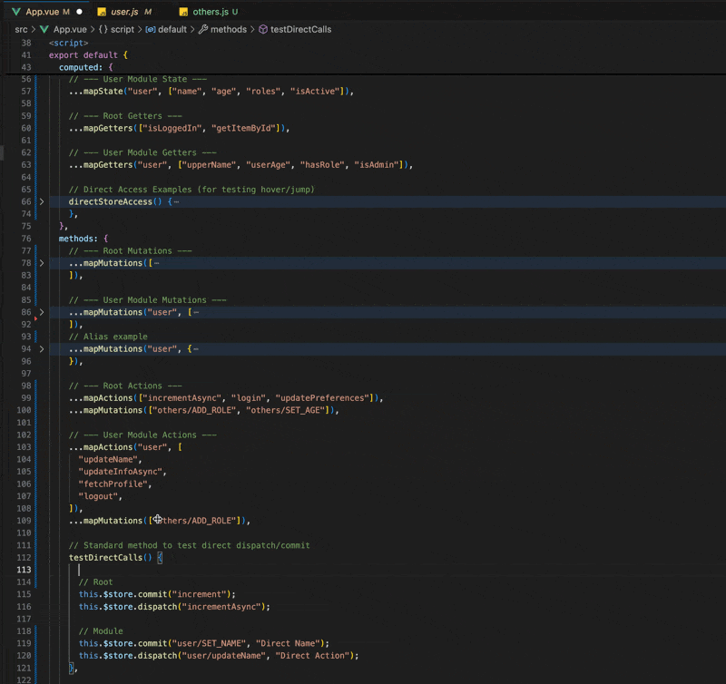
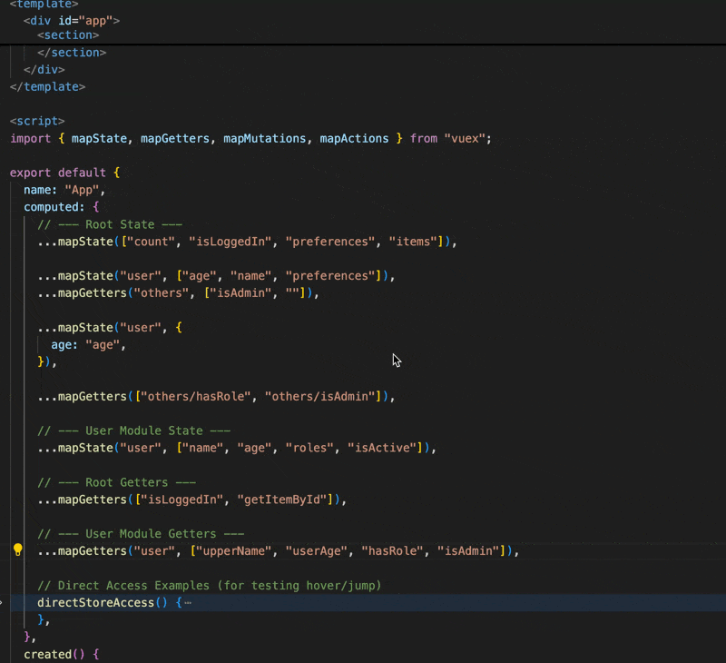
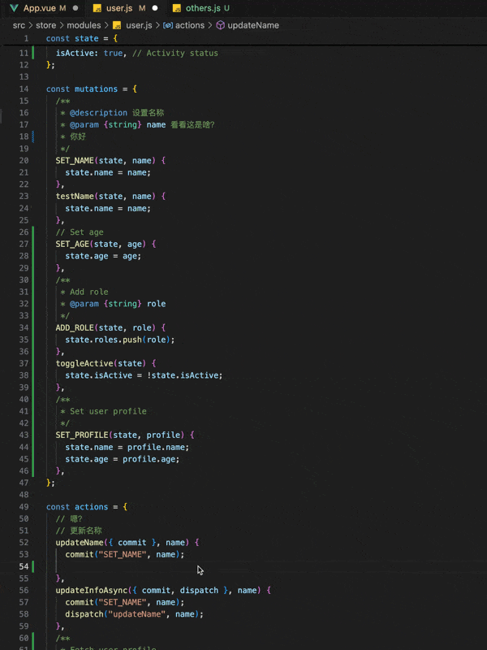

# Vuex Helper (中文说明)

适用于 Vuex 2 的 VS Code 插件，提供 **跳转定义**、**代码补全** 和 **悬浮提示** 功能。支持 State, Getters, Mutations 和 Actions。

## 功能特性

### 1. 跳转定义 (Go to Definition)

从组件中直接跳转到 Vuex Store 的定义处。

#### 演示：跳转定义


- **支持**: `this.$store.state/getters/commit/dispatch`
- **Map 辅助函数**: `mapState`, `mapGetters`, `mapMutations`, `mapActions`
- **命名空间**: 完美支持 Namespaced 模块及其嵌套。

### 2. 智能代码补全 (Intelligent Code Completion)

智能提示 Vuex 的各种 Key 以及组件中映射的方法。

#### 演示：智能补全




- **上下文感知**: 在 `dispatch` 中提示 Actions，在 `commit` 中提示 Mutations。
- **命名空间过滤**: 当使用 `mapState('user', [...])` 时，会自动过滤并仅显示 `user` 模块下的内容。
- **组件映射方法**: 输入 `this.` 即可提示映射的方法（例如 `this.increment` 映射自 `...mapMutations(['increment'])`）。
- **语法支持**: 支持数组语法和对象别名语法 (例如 `...mapActions({ alias: 'name' })`)。

### 3. 悬浮提示与类型推导 (Hover Information & Type Inference)

无需跳转即可查看文档、类型详情。

#### 演示：悬浮文档



- **JSDoc 支持**: 提取并显示 Store 定义处的 `/** ... */` 注释文档。
- **State 类型**: 在悬浮提示中自动推导并显示 State 属性的类型 (例如 `(State) appName: string`)。
- **详细信息**: 显示类型（State/Mutation等）及定义所在的文件路径。
- **映射方法**: 支持查看映射方法的 Store 文档。

### 4. Store 内部调用 (Store Internal Usage)

同样支持在 Vuex Store 内部 代码补全、跳转、悬浮提示。

#### 演示：Store 内部 代码补全、跳转、悬浮提示



- **模块作用域**: 当在模块文件（如 `user.js`）中编写 Action 时，`commit` 和 `dispatch` 的代码补全会自动过滤并仅显示当前模块的内容。

同样支持在 Vuex Store 内部 代码补全、跳转、悬浮提示。

## 支持的语法示例

- **辅助函数 (Helpers)**:
  ```javascript
  ...mapState(['count'])
  ...mapState('user', ['name']) // 命名空间支持
  ...mapActions({ add: 'increment' }) // 对象别名支持
  ...mapActions(['add/increment'])
  ```
- **Store 方法**:
  ```javascript
  this.$store.commit("SET_NAME", value);
  this.$store.dispatch("user/updateName", value);
  ```
- **组件方法**:
  ```javascript
  this.increment(); // 映射自 mapMutations
  this.appName; // 映射自 mapState
  ```

## 使用要求

- 使用 Vuex 的 Vue 2 项目。
- Store 入口位于 `src/store/index.js` 或 `src/store/index.ts`（支持自动探测）。
- 若无法自动找到，请在设置中配置 `vuexHelper.storeEntry`。

## 配置项

- `vuexHelper.storeEntry`: 手动指定 Store 入口文件路径。支持：
  - 别名路径: `@/store/index.js` (需在 jsconfig/tsconfig 中配置)
  - 相对路径: `src/store/index.js`
  - 绝对路径: `/User/xxx/project/src/store/index.js`

## 更新日志

### 0.0.1

初始版本，支持功能：

- 全面支持 State, Getters, Mutations, Actions
- 支持命名空间过滤 (Namespace Filtering)
- 支持 JSDoc 悬浮文档显示
